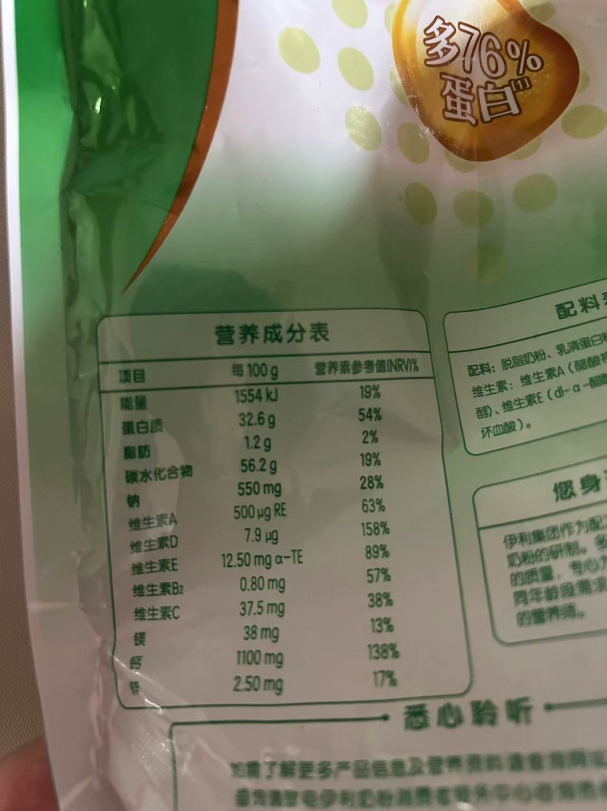
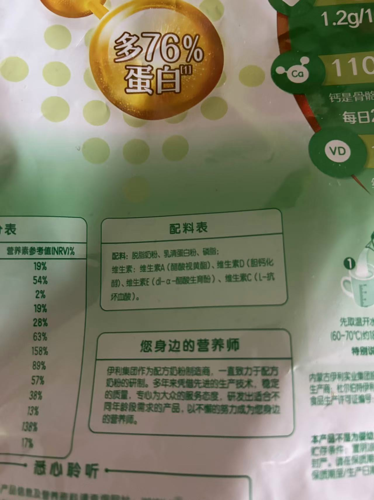

## 营养成分表

**NRV(%)**：营养成分表参考值---->人体一天所需营养成分的百分比
能量和热量换算说明
- 换算公式 — 1 kcal = 4.184 kJ ， 1 kJ = 0.239 kcal
- 计算示例 — 1000 kJ ≈ 239 kcal，250 kcal = 1046 kJ

计算热量简单方法直接除以4估算

增重减肥各种理论五花八门，七嘴八舌，但核心->热量缺口
 - 管住嘴，迈开腿

--- 

## 配料表

默认含量从高到低

--- 

## 生产商和产地

生产商->品控能力

产地->决定品质

委托方->销售品牌方

收委托方->生产商

委托方和被委托方---->俗称贴牌

**核心关注生产商水平和产地**

---

## 食品执行标准

- ✅ GB 开头的是强制性国家标准，必须执行
- ✅ GB/T 开头的是推荐性国家标准
- ✅ Q/ 开头的是企业标准，需在当地监管部门备案
- ❌ 无执行标准号的食品需谨慎购买 

仅供参考，不是专业人士知道GB/T > GB ，  Q/ > GB  足矣

食品最终还是口感和营养价值的平衡，营业成分表重要
